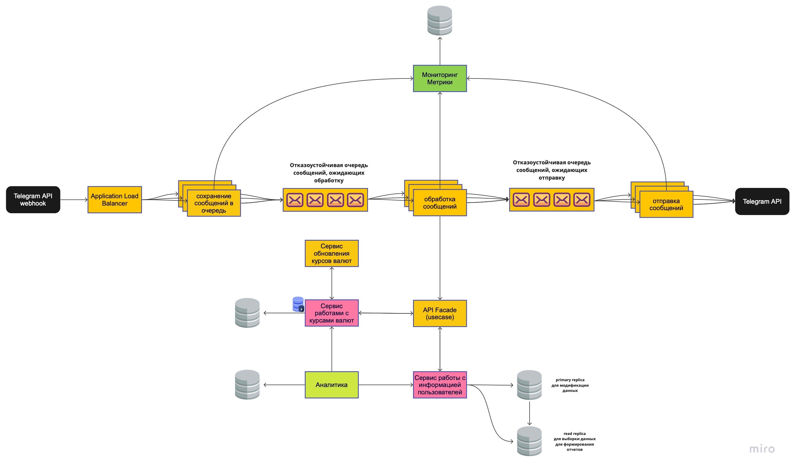

# telegram-bot myasnikov.alexander.s@gmail.com

## GOHW-4

Оригинал: https://miro.com/app/board/uXjVPLcnlMM=/?share_link_id=427882255094

### Функциональные требования
* Предоставляет статистику по расходам
* Сопоставляет расходы с лимитами

### Нефункциональные требования
* Низкое время отклика
* Отказоустойчивость
* Сохранность данных
* Мониторинг

### Оценки на 1 пользователя
#### Telegram API <-> app
* Среднее число запросов в сутки ~10 (добавить расход ~5, получить отчет ~3, прочий тип~2)
* Средний размер запроса через API telegram ~500+200+70 байт (http заголоки + json формат + текст от пользователя)
* Средний размер ответа через API telegram ~500+200+1000 байт (http заголоки + json формат + текст для пользователя)
* RPS = 10 / 24 / 60 / 60 = 0.00012 запросов/сек
* BPS = 10 * (500+200+70 + 500+200+1000) / 24 / 60 / 60 = 0.29 байт/сек

#### app <-> База данных
* Средний размер данных "пользователь" в БД ~64+64 байта (полезная нагрузка + индексы, системная информация)
* Средний размер данных "расход" в БД ~320+2*64 байт (полезная нагрузка + индексы, системная информация)
* Прирост данных в БД = 5 * (320+2*64) = 2240 байт/сутки
* Кеш не используем, т.к. данные для самой затратной операции по памяти и времени "получить отчет" становятнся неактуальными после самой частой операции "добавить расход", т.е. постоянно нужно пересчитывать или оптимизировать эту операцию.
* Данные храним за 2 года(текущий календарный + предыдущий), размер (64+64) + 2*365*5*(320+2*64) + 10% = 1798860.8 байт = 1.8 Мб (данные "пользователь" + данные "расходы" + накладные системные расходы)
* Бекап - x2 = 3.6 Мб
* Реплику считаем отдельно, т.к. для простых систем не требуется

Максимальные показатели отдельно считать не будем, т.к. данные очень усредненные и не учитываем распределение в течение суток. При необходимости берем x5

#### Оценки системы на 1k пользователей
* RPS = 1000 * 0.00012 = 0.12 запросов/сек
* BPS = 1000 * 0.29 = 290 байт/сек
* БД = 1000 * (1.8 + 3.6 + 0) = 5.4 Гб (primary replica + backup + read replica)

### Оценки системы на 100k пользователей
* RPS = 100000 * 0.00012 = 12 запросов/сек
* BPS = 100000 * 0.29 = 29 кб/сек
* БД = 100000 * (1.8 + 3.6 + 1.8) = 7.2 Тб

### Оценки системы на 1m пользователей
* RPS = 1000000 * 0.00012 = 120 запросов/сек
* BPS = 1000000 * 0.29 = 290 кб/сек
* БД = 1000000 * (1.8 + 3.6 + 1.8) = 72 Тб

### Вывод
* 120 запросов/сек кажется не так уж много, по 2-3 воркера хватит для работы с очередями (если вдруг один упадет, то это не будет заметно)
* 290 кб/сек очень маленькая нагрузка, проблем не должно быть
* БД на 72 Тб - самое проблемное место, которое может работать очень долго. Если требования не изменятся, то нужно подумать о том, чтобы не хранить все расходы одиночными записями, а сразу агрегировать по интервалам и категориям. Это позволит заметно снизить размер БД и быстрее строить получить данные для отчета.

